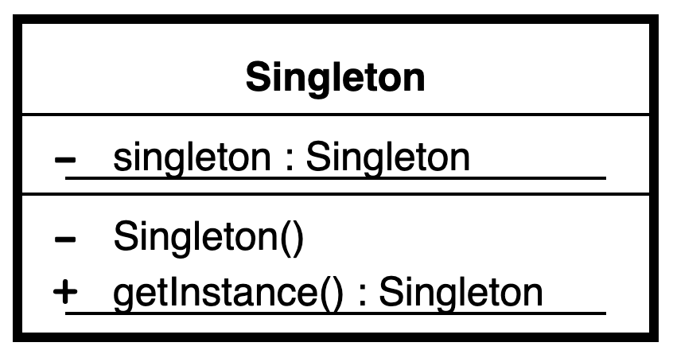
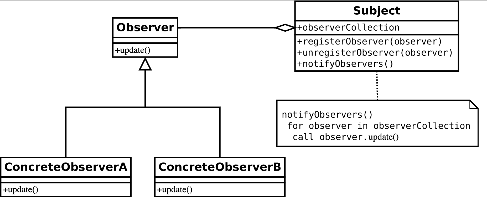

# Central Messaging System
This project implements a central messaging system using a single central dispatcher object as a **singleton** [2]. The application allows to send messages to **topics** in the form of strings. The objects can subscribe to **topics**, and if a message is sent with that topic, all objects subscribed to it receive it. **Observer pattern** is implemented [2-4].

## Singleton pattern
In software engineering, the singleton pattern is a software design pattern that restricts the instantiation of a class to one "single" instance. This is useful when exactly one object is needed to coordinate actions across the system. The term comes from the mathematical concept of a singleton [1].

\
Fig. 1 - UML class design

## Observer pattern
The observer pattern is a software design pattern in which an object, named the subject, maintains a list of its dependents, called observers, and notifies them automatically of any state changes, usually by calling one of their methods [2].

\
Fig. 2 - UML class design

## References
[1] - [Singleton Pattern Wikipedia](https://en.wikipedia.org/wiki/Singleton_pattern)\
[2] - [Observer Pattern Wikipedia](https://en.wikipedia.org/wiki/Observer_pattern)\
[3] - SHVETS, Alexander. Dive Into Design Patterns. Refactoring. Guru, 2018.
\
[4] - [PPCU, Budapest. Design Patterns](http://ipcv.eu/blog/course/programming-methodology/)